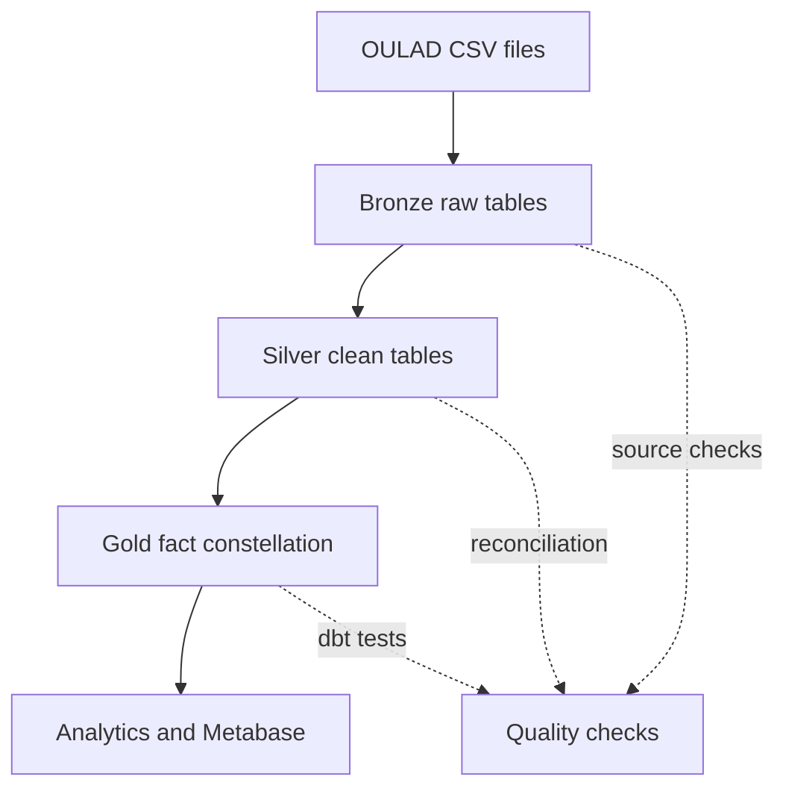
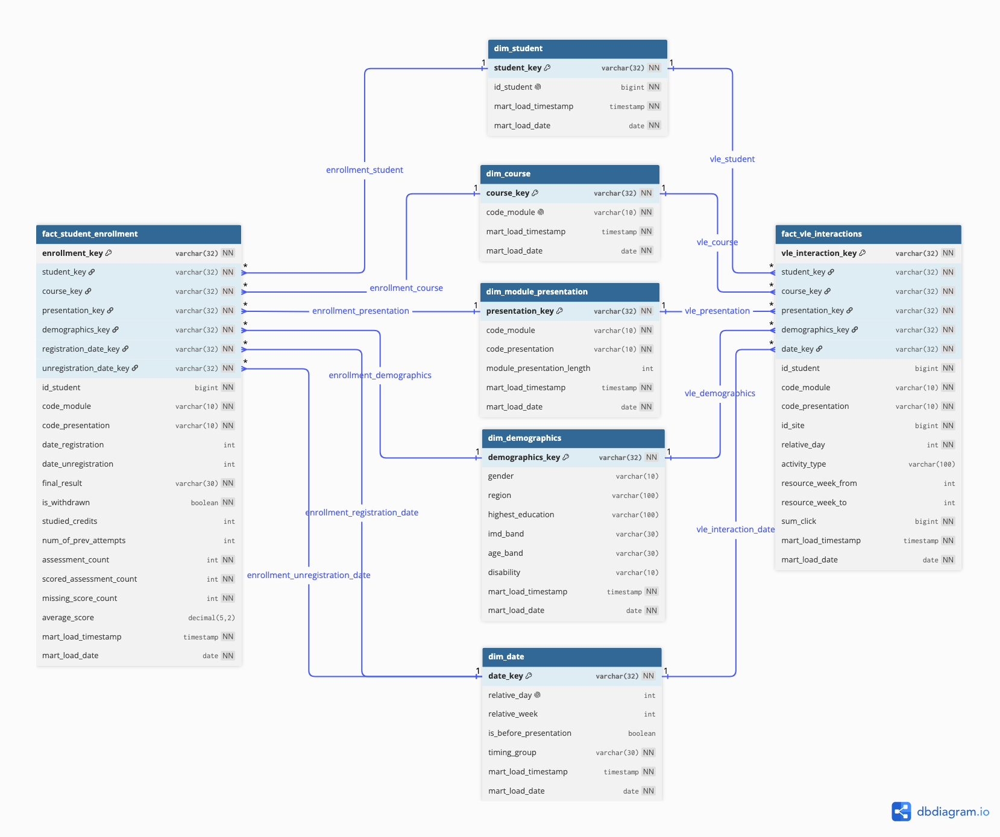

# OULAD Data Engineering Pipeline

This project builds a reproducible Databricks pipeline for the Open University Learning Analytics Dataset (OULAD). It transforms seven source files through Bronze, Silver, and Gold layers so student enrollment, outcomes, assessments, and learning-platform activity can be analyzed together.

## Business questions

The pipeline supports four questions:

1. How does engagement relate to performance?
2. What patterns appear among students who withdraw?
3. How does student activity change throughout a course?
4. Do demographics influence dropout?

## Architecture



| Layer | Schema | Purpose |
| --- | --- | --- |
| Bronze | `open_university.oulad_bronze` | Preserves source values and ingestion metadata |
| Silver | `open_university.oulad_silver` | Cleans types, keys, categories, and repeated records |
| Gold | `open_university.oulad_gold` | Provides dimensions, facts, and a reporting view |
| Quality | `open_university.oulad_quality` | Stores quarantined records when applicable |

## Gold dimensional model

The Gold layer is a **fact constellation**, not a single star schema, because two fact tables share five dimensions.



[Open the interactive ERD in dbdiagram.io](https://dbdiagram.io/d/OULAD-Dimensional-Model-Fact-Constellation-6aa2df5afa33334712c0619c0)

### Dimensions

| Model | Grain |
| --- | --- |
| `dim_student` | One row per student |
| `dim_course` | One row per module |
| `dim_module_presentation` | One row per module and presentation combination |
| `dim_date` | One row per observed relative day plus one Unknown record |
| `dim_demographics` | One row per distinct demographic profile |

### Facts and reporting view

| Model | Type | Grain |
| --- | --- | --- |
| `fact_student_enrollment` | Fact | One student enrollment in one module presentation |
| `fact_vle_interactions` | Fact | One student, presentation, VLE resource, and relative day |
| `vw_student_outcomes` | View | One student enrollment in one module presentation |

`fact_student_enrollment` contains enrollment outcomes and assessment summaries. `fact_vle_interactions` keeps detailed daily engagement. The reporting view starts from the complete enrollment population and joins separately aggregated VLE measures, so students with no recorded activity remain included.

OULAD dates are relative day offsets from the module presentation start. They are not converted into calendar dates because the source does not provide a reliable calendar start date for every presentation.

Schema references:

- [Fact constellation guide](docs/erd/oulad_fact_constellation.md)
- [DBML definition](docs/erd/oulad_fact_constellation.dbml)

## Validated results

The Gold models were deployed from `main` using a Databricks dbt Job. The final run completed with `PASS=125`, `WARN=0`, `ERROR=0`, and `SKIP=0`.

| Check | Result |
| --- | ---: |
| Enrollments | 32,593 |
| Unique enrollment keys | 32,593 |
| Withdrawn enrollments | 10,156 |
| Assessment results | 173,912 |
| Scored assessment results | 173,739 |
| Missing scores | 173 |
| Daily VLE fact rows | 8,459,320 |
| Unique VLE interaction keys | 8,459,320 |
| Total VLE clicks | 39,605,099 |
| Enrollments with no VLE activity | 3,365 |

These results confirm the declared fact grains and reconcile the main enrollment, assessment, and click measures with Silver.

## Repository structure

| Path | Purpose |
| --- | --- |
| `src/sql/00_setup/` | Creates the Databricks catalog and schemas |
| `src/sql/01_raw/` | Loads the seven source files into Bronze |
| `src/sql/02_clean/` | Builds the Silver tables |
| `dbt/models/` | Builds the five dimensions, two facts, and reporting view |
| `dbt/tests/` | Contains automated Gold grain and reconciliation tests |
| `src/sql/03_analytics/` | Contains the four business-analysis queries |
| `tests/` | Contains source, Silver, Gold, and business checks |
| `docs/` | Contains profiling results, assumptions, and the detailed plan |
| `.github/workflows/` | Contains repository validation and deployment workflow definitions |

## Source tables

| Source file | Bronze table | Rows |
| --- | --- | ---: |
| `assessments.csv` | `assessment_raw` | 206 |
| `courses.csv` | `courses_raw` | 22 |
| `studentAssessment.csv` | `student_assessment_raw` | 173,912 |
| `studentInfo.csv` | `student_info_raw` | 32,593 |
| `studentRegistration.csv` | `student_registration_raw` | 32,593 |
| `studentVle.csv` | `student_vle_raw` | 10,655,280 |
| `vle.csv` | `vle_raw` | 6,364 |

## Run order

### Requirements

- Databricks workspace with Unity Catalog
- Permission to create the project catalog and schemas
- Access to the seven OULAD CSV files
- Python and the packages in `dbt/requirements.txt` for local dbt use

Do not commit source files, generated datasets, tokens, or credentials.

### 1. Get the repository

```bash
git clone https://github.com/ItsYangCoder/oulad-data-engineering-pipeline.git
cd oulad-data-engineering-pipeline
```

For Databricks execution, connect the same repository through a Databricks Git folder.

### 2. Set up the project

Run:

```text
src/sql/00_setup/00_init_setup.sql
```

Update the source paths in the Bronze scripts for the target Databricks environment.

### 3. Build and validate Bronze

Run these scripts in order:

```text
src/sql/01_raw/assessment_raw.sql
src/sql/01_raw/courses_raw.sql
src/sql/01_raw/student_assessment_raw.sql
src/sql/01_raw/student_info_raw.sql
src/sql/01_raw/student_registration_raw.sql
src/sql/01_raw/student_vle_raw.sql
src/sql/01_raw/vle_raw.sql
```

Then run the checks in `tests/01_source_checks/`.

### 4. Build and validate Silver

Run these scripts in order:

```text
src/sql/02_clean/courses_clean.sql
src/sql/02_clean/assessment_clean.sql
src/sql/02_clean/student_assessment_clean.sql
src/sql/02_clean/student_info_clean.sql
src/sql/02_clean/student_registration_clean.sql
src/sql/02_clean/vle_clean.sql
src/sql/02_clean/student_vle_clean.sql
```

Then run the checks in `tests/02_clean_checks/`.

The Silver transformations use business-key `MERGE` operations. Missing rows in a partial delivery are not automatically deleted.

### 5. Build and test Gold

For local dbt execution, copy `dbt/profiles.yml.example` to `dbt/profiles.yml`, provide the required environment variables, then run:

```bash
cd dbt
python -m pip install -r requirements.txt
dbt deps --profiles-dir .
dbt build --profiles-dir . --target dev
```

The production Databricks Job uses project directory `dbt` and runs:

```bash
dbt deps
dbt build
```

### 6. Run final checks and analytics

Run:

```text
tests/03_gold_checks/
tests/04_business_checks/
src/sql/03_analytics/
```

## CI and deployment status

GitHub Actions validates pull requests and pushes to `main` by scanning for secrets, blocking newly added destructive SQL, validating YAML and Databricks SQL, and parsing the dbt project.

The Gold layer is currently deployed through the validated Databricks dbt Job. The GitHub deployment workflow remains disabled until its authentication, target, and release process are tested end to end.

## Current limitations

- Metabase visuals and their links or screenshots are not yet included.
- Business interpretations, recommendations, and conclusions will be finalized after dashboard validation.
- OULAD activity is measured using clicks and active days; clicks are not treated as study duration.
- Missing demographic values and dates remain unknown unless a documented business rule provides a valid replacement.

## Documentation

- [Pipeline plan](docs/pipeline_plan.md)
- [Source profiling results](docs/source_assessment.md)
- [Project assumptions](docs/assumptions.md)

## Contribution workflow

1. Start from the latest `main` branch.
2. Create a branch for one related change.
3. Update the assigned files and their checks.
4. Validate the change locally or in Databricks.
5. Open a pull request and record real validation evidence.
6. Merge only after the required checks pass.
