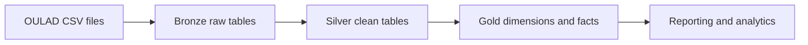

# OULAD Data Engineering Pipeline

A reproducible Databricks pipeline for the Open University Learning Analytics Dataset (OULAD). It transforms seven source files through Bronze, Silver, and Gold layers for student outcomes, assessments, and VLE engagement analysis.

## Architecture



| Layer | Schema | Purpose |
| --- | --- | --- |
| Bronze | `open_university.oulad_bronze` | Preserves source data and ingestion metadata |
| Silver | `open_university.oulad_silver` | Cleans types, keys, categories, and repeated records |
| Gold | `open_university.oulad_gold` | Provides the dimensional model and reporting view |
| Quality | `open_university.oulad_quality` | Stores quality results and rejected records |

## Gold dimensional model

The Gold layer uses a fact constellation: **5 dimensions and 2 fact tables**. The facts remain separate because they have different grains.


[Open the interactive ERD](https://dbdiagram.io/d/OULAD-Dimensional-Model-Fact-Constellation-6aa2df5afa33334712c0619c0)

### Dimensions

`dim_student` · `dim_course` · `dim_module_presentation` · `dim_date` · `dim_demographics`

### Facts and reporting view

| Model | Grain |
| --- | --- |
| `fact_student_enrollment` | One student enrollment in one module presentation |
| `fact_vle_interactions` | One student, presentation, VLE resource, and relative day |
| `vw_student_outcomes` | One student enrollment in one module presentation |

Assessment summaries are kept at enrollment grain, while detailed VLE activity remains at daily resource grain. The reporting view aggregates VLE activity before joining it to enrollments so students with no activity remain included.

## Repository structure

| Path | Purpose |
| --- | --- |
| `src/sql/00_setup/` | Creates the catalog and schemas |
| `src/sql/01_raw/` | Loads source files into Bronze |
| `src/sql/02_clean/` | Builds Silver tables |
| `dbt/models/` | Builds the dimensions, facts, and reporting view |
| `dbt/tests/` | Runs Gold grain and reconciliation tests |
| `src/sql/03_analytics/` | Contains business-analysis queries |
| `tests/` | Contains source, Silver, Gold, and business checks |
| `docs/` | Contains project documentation and assumptions |
| `.github/workflows/` | Contains CI/CD workflows |

## Run order

1. Run `src/sql/00_setup/00_init_setup.sql`.
2. Run the scripts in `src/sql/01_raw/`.
3. Run the scripts in `src/sql/02_clean/`.
4. Run the checks in `tests/01_source_checks/` and `tests/02_clean_checks/`.
5. Configure `dbt/profiles.yml` from `dbt/profiles.yml.example` and set its required environment variables. From the `dbt/` directory, run:

```bash
python -m pip install -r requirements.txt
dbt deps --profiles-dir .
dbt build --profiles-dir . --target dev
```

6. Run the SQL checks in `tests/03_gold_checks/` and `tests/04_business_checks/`. The dbt tests run through `dbt build` above.
7. Run the queries in `src/sql/03_analytics/`.

The Silver layer uses business-key `MERGE` operations. A partial delivery does not automatically delete existing records.

## CI/CD

GitHub Actions validates pull requests and pushes to `main`. It checks secrets, YAML, Databricks SQL, dbt parsing, disabled tests, and newly added destructive SQL.

Deployment uses a Databricks service principal with OAuth M2M authentication. The workflow triggers the existing Databricks Job; runtime dbt tests and data-quality checks run inside Databricks because they need access to the Silver data.

See [Databricks CD setup](docs/deployment.md) for configuration details.

## Validation snapshot

Previously recorded validation: `PASS=125`, `WARN=0`, `ERROR=0`, and `SKIP=0`. This is a historical snapshot, not validation of subsequent code changes.

| Check | Result |
| --- | ---: |
| Enrollments | 32,593 |
| Assessment results | 173,912 |
| Daily VLE fact rows | 8,459,320 |
| Total VLE clicks | 39,605,099 |

## Notes

- OULAD dates are relative day offsets, not calendar dates.
- Clicks and active days are engagement measures, not study duration.
- Do not commit source files, generated datasets, tokens, or credentials.

## Documentation

- [Pipeline plan](docs/pipeline_plan.md)
- [Source profiling](docs/source_assessment.md)
- [Project assumptions](docs/assumptions.md)
- [Fact constellation guide](docs/erd/oulad_fact_constellation.md)
